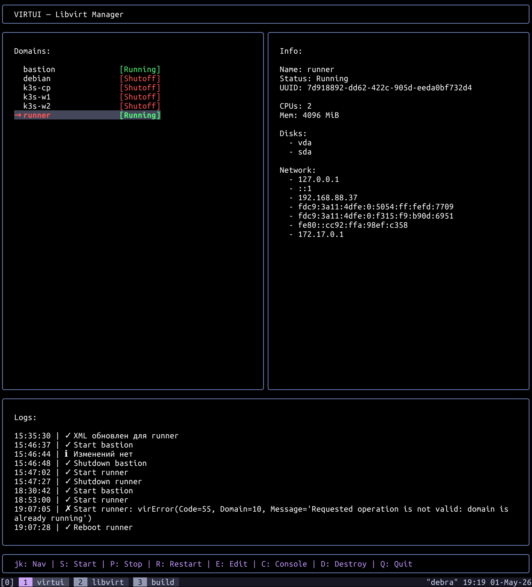

### virtui - tui for libvirt

------

Install:
* sudo apt install -y libvirt-dev pkg-config
* go mod init virtui
* go mod tidy
* go build -o virtui cmd/tui/main.go
* sudo cp ./virtui /usr/local/bin/vtui
* echo "uri = \"qemu:///system\"" >> ~/.config/libvirt/libvirt.conf
* sudo usermod -aG libvirt,libvirt-qemu,kvm $USER
* vtui
<br>

TODO:
* ⊂(◉‿◉)つ
* сделать языковый пакет, но кому оно надо..

<br>

Hotkeys:
* jk - up / down for machines
* Shift +
  * s - start unactive machine
  * p - stop active machine
  * r - restart active machine
  * e - edit xml of unactive machine
  * c - connect to active machine
  * k - clone unactive machine with custom name [new uuid, mac]
  * d - destroy and undefine unactive machine
  * q - exit programm

<br>

$ ls ~/.local/virtui/
```bash
config  virtui.log
```

$ cat ~/.local/virtui/config 
```json
{
  "max_log_lines": 20,
  "ipv4_only": true,
  "libvirt_dir": "/var/lib/libvirt/"
}
```

<br>


